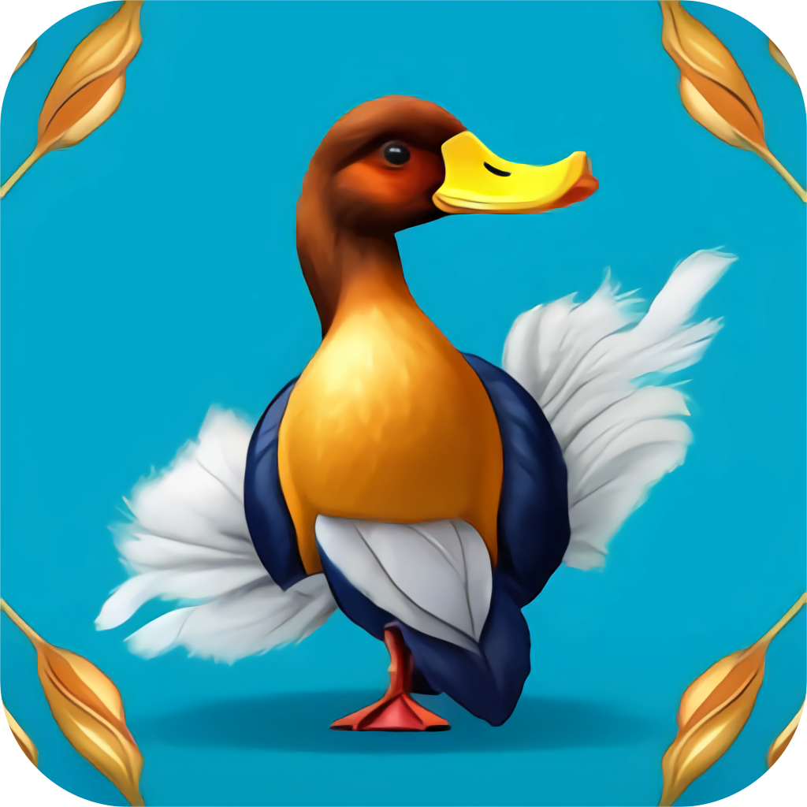

# RandomDuck
 Duck images using random-d.uk API. Written in SwiftUI. iOS 15 and higher (as it uses AsyncImage).

# Installing
 You can compile yourself or download the .IPA from the releases tab. Install the .IPA with any tool like AltStore or TrollStore.

# Thanks to
 https://random-d.uk/
